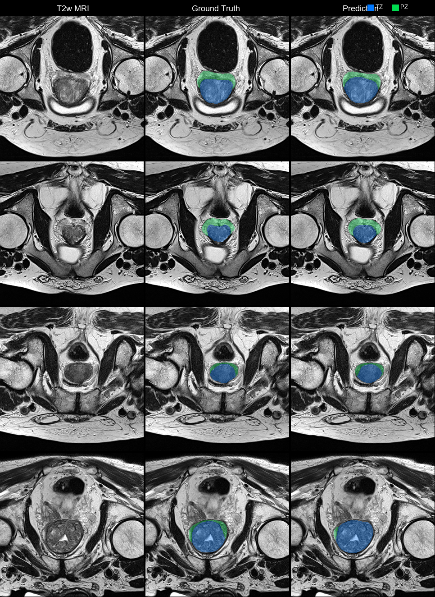

# Prostate Zone Segmentation with nnU-Net

Fully automatic segmentation of the **Transition Zone (TZ)** and **Peripheral Zone (PZ)** from T2-weighted prostate MRI using [nnU-Net v2](https://github.com/MIC-DKFZ/nnUNet).

<p align="center">
  
</p>

<p align="center">
  
  <br><em>Animated slice-by-slice view — T2w MRI | Ground Truth | Prediction</em>
</p>

---

## Highlights

- **State-of-the-art** prostate zone segmentation on a multi-site dataset
- **No manual configuration** — self-configuring nnU-Net pipeline
- **Portable inference** — single script, no hardcoded paths
- Trained on **258 cases** from three public datasets, evaluated on **27 held-out cases**

## Performance

### Test set results (27 cases, held-out)

| Metric | Dice Score |
|--------|-----------|
| **Transition Zone (TZ)** | 0.857 |
| **Peripheral Zone (PZ)** | 0.763 |
| **Mean** | **0.810** |

### Per-dataset breakdown

| Dataset | N (test) | TZ Dice | PZ Dice | Mean Dice |
|---------|----------|---------|---------|-----------|
| Prostate158 | 12 | 0.884 | 0.790 | 0.837 |
| MSD Task05 | 3 | 0.901 | 0.791 | 0.846 |
| BMC | 12 | 0.816 | 0.731 | 0.773 |
| **Overall** | **27** | **0.857** | **0.763** | **0.810** |

### Comparison with baseline models

| Model | TZ | PZ | Mean |
|-------|-----|-----|------|
| MONAI U-Net (baseline) | 0.764 | 0.579 | 0.672 |
| MONAI U-Net + augmentation tuning | 0.773 | 0.608 | 0.691 |
| MONAI U-Net + TTA + overlap 0.5 | 0.770 | 0.629 | 0.700 |
| **nnU-Net 3d_fullres (this work)** | **0.857** | **0.763** | **0.810** |

---

## Model Details

| Property | Value |
|----------|-------|
| Framework | [nnU-Net v2](https://github.com/MIC-DKFZ/nnUNet) (v2.6) |
| Architecture | PlainConvUNet (3D) |
| Encoder stages | 7 |
| Features per stage | 32 → 64 → 128 → 256 → 320 → 320 → 320 |
| Convolution kernel | 3×3×3 (with 1×3×3 in early stages) |
| Normalization | InstanceNorm3d |
| Activation | LeakyReLU |
| Loss | Dice + Cross-Entropy (deep supervision) |
| Patch size | 24 × 256 × 256 |
| Spacing | 3.0 × 0.6 × 0.6 mm |
| Batch size | 2 |
| Training epochs | 1000 |
| Optimizer | SGD (momentum 0.99, weight decay 3×10⁻⁵) |
| Learning rate | Polynomial decay (initial 0.01) |
| Input | Single-channel axial T2-weighted MRI |

### Output labels

| Value | Structure |
|-------|-----------|
| 0 | Background |
| 1 | Transition Zone (TZ) |
| 2 | Peripheral Zone (PZ) |

---

## Training Data

The model was trained on 258 T2-weighted prostate MRI volumes from three publicly available datasets (27 held out for testing):

| Dataset | Cases | Resolution | Source |
|---------|-------|------------|--------|
| [Prostate158](https://doi.org/10.5281/zenodo.6481141) | 139 train + 12 test | Variable (~0.5 mm in-plane) | Bressem et al. 2022 |
| [MSD Task05](http://medicaldecathlon.com/) | 29 train + 3 test | Variable | Antonelli et al. 2022 |
| [BMC](https://doi.org/10.5281/zenodo.7676958) | 90 train + 12 test | 0.625 mm in-plane | Gibala et al. 2023 |
| **Total** | **258 train/val + 27 test** | | |

The train/validation split (217/41) with seed 42 is provided in [`splits/split_seed42.json`](splits/split_seed42.json).

> **Note**: MSD Task05 labels have TZ and PZ swapped relative to Prostate158 convention. The data conversion script handles this automatically.

---

## Installation

### Requirements

- Python ≥ 3.10
- CUDA-capable GPU with ≥ 8 GB VRAM
- ~400 MB disk space for the model checkpoint

### Setup

```bash
git clone https://github.com/Brozey/prostate-zone-segmentation.git
cd prostate-zone-segmentation
pip install -r requirements.txt
```

### Download model weights

The trained model checkpoint (~341 MB) is available from [GitHub Releases](https://github.com/Brozey/prostate-zone-segmentation/releases/tag/v1.0):

```bash
# Download and place in the correct location:
python download_weights.py
```

Or manually download `checkpoint_final.pth` from the release and place it at:
```
nnUNet_results/Dataset501_ProstateZones/nnUNetTrainer__nnUNetPlans__3d_fullres/fold_0/checkpoint_final.pth
```

---

## Usage

### Inference (segmenting new images)

```bash
# Segment all NIfTI images in a folder
python predict.py  -i /path/to/t2w_images/  -o /path/to/output/

# Segment a single image
python predict.py  -i patient_t2w.nii.gz  -o output/

# Use CPU instead of GPU
python predict.py  -i input/  -o output/  --gpu -1

# Also save probability maps
python predict.py  -i input/  -o output/  --save-probabilities
```

Input images should be standard NIfTI (`.nii.gz`) T2-weighted axial prostate MRI volumes. The script handles all nnU-Net formatting automatically.

### Training from scratch

To reproduce the training:

1. **Download the datasets** — Prostate158, MSD Task05, and BMC (see links above)

2. **Convert to nnU-Net format**:
   ```bash
   python scripts/convert_to_nnunet.py \
       --prostate158 /path/to/prostate158/train \
       --msd /path/to/Task05_Prostate \
       --bmc /path/to/prostate_dataset \
       --output /path/to/nnUNet_raw \
       --splits splits/split_seed42.json
   ```

3. **Preprocess**:
   ```bash
   export nnUNet_raw="/path/to/nnUNet_raw"
   export nnUNet_preprocessed="/path/to/nnUNet_preprocessed"
   export nnUNet_results="/path/to/nnUNet_results"
   nnUNetv2_plan_and_preprocess -d 501 --verify_dataset_integrity
   ```

4. **Copy custom split** (to preserve the exact train/val split):
   ```bash
   cp nnUNet_raw/Dataset501_ProstateZones/custom_splits.json \
      nnUNet_preprocessed/Dataset501_ProstateZones/splits_final.json
   ```

5. **Train**:
   ```bash
   nnUNetv2_train 501 3d_fullres 0
   ```

### Evaluation

```bash
# Predict on test set
nnUNetv2_predict -i nnUNet_raw/Dataset501_ProstateZones/imagesTs \
                 -o test_predictions -d 501 -c 3d_fullres -f 0

# Compute Dice scores
python scripts/evaluate.py \
    --predictions test_predictions \
    --ground-truth nnUNet_raw/Dataset501_ProstateZones/labelsTs \
    --id-mapping nnUNet_raw/Dataset501_ProstateZones/id_mapping.json
```

---

## Repository Structure

```
prostate-zone-segmentation/
├── predict.py                   # Main inference script
├── download_weights.py          # Download model from GitHub Releases
├── requirements.txt             # Python dependencies
├── README.md
├── LICENSE
├── .gitignore
├── splits/
│   └── split_seed42.json        # Train/val/test case IDs
├── scripts/
│   ├── convert_to_nnunet.py     # Dataset conversion to nnU-Net format
│   └── evaluate.py              # Test set evaluation
├── nnUNet_results/              # Model weights (after download)
│   └── Dataset501_ProstateZones/
│       └── nnUNetTrainer__nnUNetPlans__3d_fullres/
│           ├── dataset.json
│           ├── dataset_fingerprint.json
│           ├── plans.json
│           └── fold_0/
│               └── checkpoint_final.pth  (not tracked in git — download separately)
└── assets/
    └── example_prediction.png   # Example figure for README
```

---

## Citation

If you use this model in your research, please cite the underlying datasets and nnU-Net:

```bibtex
@article{isensee2021nnu,
  title={nnU-Net: a self-configuring method for deep learning-based biomedical image segmentation},
  author={Isensee, Fabian and Jaeger, Paul F and Kohl, Simon AA and Petersen, Jens and Maier-Hein, Klaus H},
  journal={Nature Methods},
  volume={18},
  number={2},
  pages={203--211},
  year={2021},
  publisher={Nature Publishing Group}
}

@article{bressem2022prostate158,
  title={Prostate158 — An expert-annotated 3T MRI dataset and algorithm for prostate cancer detection},
  author={Bressem, Keno K. and Adams, Lisa C. and Engel, G{\"u}nther},
  journal={Computers in Biology and Medicine},
  volume={148},
  pages={105817},
  year={2022},
  doi={10.5281/zenodo.6481141}
}

@article{antonelli2022msd,
  title={The Medical Segmentation Decathlon},
  author={Antonelli, Michela and Reinke, Annika and Bakas, Spyridon and others},
  journal={Nature Communications},
  volume={13},
  number={1},
  pages={4128},
  year={2022},
  doi={10.1038/s41467-022-30695-9}
}

@article{gibala2023bmc,
  title={Textural Features of MR Images Correlate with an Increased Risk of Clinically Significant Cancer in Patients with High PSA Levels},
  author={Gibala, Sebastian and Obuchowicz, Rafal and Lasek, Julia and Schneider, Zofia and Piorkowski, Adam and Pociask, Elzbieta and Nurzynska, Karolina},
  journal={Journal of Clinical Medicine},
  volume={12},
  number={8},
  pages={2836},
  year={2023},
  doi={10.3390/jcm12082836}
}

@article{gibala2023pirads,
  title={Textural Analysis Supports Prostate MR Diagnosis in PIRADS Protocol},
  author={Giba{\l}a, Sebastian and Obuchowicz, Rafal and Lasek, Julia and Pi{\'o}rkowski, Adam and Nurzynska, Karolina},
  journal={Applied Sciences},
  volume={13},
  number={17},
  pages={9871},
  year={2023},
  doi={10.3390/app13179871}
}
```

---

## License

This project is licensed under the [MIT License](LICENSE).

The model weights are provided for **research purposes only**. The training datasets have their own licenses — please refer to the original dataset publications.

---

## Acknowledgments

- [nnU-Net](https://github.com/MIC-DKFZ/nnUNet) by the Division of Medical Image Computing, DKFZ
- [MONAI](https://monai.io/) for the baseline model experiments
- Dataset authors: Bressem et al. (Prostate158), Antonelli et al. (Medical Segmentation Decathlon), and Gibala et al. (BMC prostate dataset)
